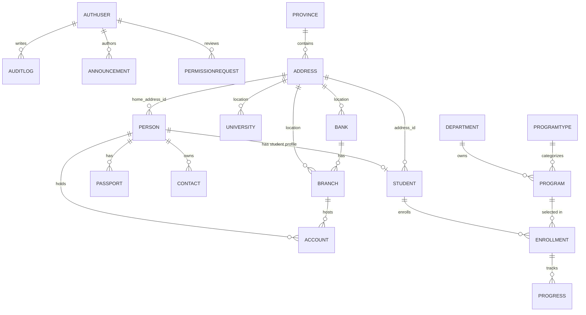

# App Data Schema (DB Layer Only)

## Overview
This schema is derived from the normalized student model used by the backend runtime.
Primary entities are student-centric and grouped into identity, academics, contact, and banking.

For full frontend data contracts (including announcements, permission requests, auth user/session, service contracts, and UI-only fields), see `docs/architecture/frontend-data-model.md`.

## Current Prisma Runtime Models

### `AuthUser`
- Stores credential-bearing auth identities used by Auth.js.
- Key fields: `id`, `role`, `loginId`, `authProvider`, `passwordHash`, `isActive`.

### `AuditLog`
- Stores auth audit events keyed optionally to `AuthUser.id`.
- Key fields: `event`, `metadata`, `ip`, `userAgent`, `createdAt`.

### `Announcement`
- Stores attache-authored announcement feed entries rendered in both attache and student dashboards.
- Key fields: `title`, `content`, `authorName`, `authorUserId`, `createdAt`.

### `PermissionRequest`
- Stores student access requests submitted from the public login flow and reviewed by attaches.
- Key fields: `inscriptionNumber`, `fullName`, `passportNumber`, `status`, `submittedAt`, `reviewedById`.

### `FileAsset`
- Stores object metadata for private files whose bytes live in object storage.
- Key fields: `purpose`, `status`, `provider`, `bucket`, `objectKey`, `studentId`, `progressId`, `uploadedByUserId`.

### `AgentContextFile`
- Stores optional agent-session linkage for file assets that should be tracked separately from user-facing documents.
- Key fields: `fileAssetId`, `ownerUserId`, `sessionId`, `source`, `purpose`.

### Normalized Student Domain
- Student records are persisted across the normalized tables documented below.
- `lib/students/store.ts` maps these tables to and from the shared `StudentProfile` contract.

## Entity Definitions

### `PERSON`
| Field | Type | Notes |
|---|---|---|
| `id` | number | PK |
| `given_name` | string |  |
| `family_name` | string |  |
| `dob` | string (date) |  |
| `gender` | string | values seen: `M`, `F` |
| `home_address_id` | number | FK -> `ADDRESS.id` |

### `STUDENT`
| Field | Type | Notes |
|---|---|---|
| `id` | number | PK |
| `person_id` | number | FK -> `PERSON.id` |
| `inscription_no` | string | unique-like identifier |
| `address_id` | number | FK -> `ADDRESS.id` (current host address) |

### `PASSPORT`
| Field | Type | Notes |
|---|---|---|
| `id` | number | PK |
| `passport_no` | string |  |
| `issue_date` | string (date) |  |
| `expiry` | string (date) |  |
| `person_id` | number | FK -> `PERSON.id` |

### `CONTACT`
| Field | Type | Notes |
|---|---|---|
| `id` | number | PK |
| `owner_id` | number | FK (logical) -> `PERSON.id` |
| `type` | string | values seen: `EMAIL`, `PHONE`, `EMERGENCY` |
| `value` | string |  |
| `label` | string | examples: `primary`, `mobile`, `name`, `phone` |
| `is_primary` | boolean |  |
| `created_at` | string (datetime) | ISO timestamp |

### `ADDRESS`
| Field | Type | Notes |
|---|---|---|
| `id` | number | PK |
| `name` | string | free-form address text |
| `wilaya_id` | number | FK -> `PROVINCE.id` |

### `PROVINCE`
| Field | Type | Notes |
|---|---|---|
| `id` | number | PK |
| `name` | string | province/city name |

### `UNIVERSITY`
| Field | Type | Notes |
|---|---|---|
| `id` | number | PK |
| `name` | string |  |
| `acronym` | string |  |
| `address_id` | number | FK -> `ADDRESS.id` |

### `DEPARTMENT`
| Field | Type | Notes |
|---|---|---|
| `id` | number | PK |
| `name` | string |  |
| `description` | string |  |

### `PROGRAMTYPE`
| Field | Type | Notes |
|---|---|---|
| `id` | number | PK |
| `name` | string | e.g. `Bachelors`, `Masters`, `PhD` |
| `default_duration` | number | years |

### `PROGRAM`
| Field | Type | Notes |
|---|---|---|
| `id` | number | PK |
| `name` | string | major/program title |
| `description` | string |  |
| `department_id` | number | FK -> `DEPARTMENT.id` |
| `programtype_id` | number | FK -> `PROGRAMTYPE.id` |

### `ENROLLMENT`
| Field | Type | Notes |
|---|---|---|
| `id` | number | PK |
| `registration_no` | string | unique-like identifier |
| `date_enrolled` | string (date) |  |
| `status` | string | values seen: `ACTIVE`, `PENDING`, `COMPLETED` |
| `student_id` | number | FK -> `STUDENT.id` |
| `program_id` | number | FK -> `PROGRAM.id` |

### `PROGRESS`
| Field | Type | Notes |
|---|---|---|
| `id` | number | PK |
| `date` | string (date) |  |
| `semester` | string |  |
| `level` | string | e.g. `L1`, `M1` |
| `grade` | string | stored as string |
| `status` | string | values seen: `COMPLETED`, `PENDING` |
| `enrollment_id` | number | FK -> `ENROLLMENT.id` |

### `BANK`
| Field | Type | Notes |
|---|---|---|
| `id` | number | PK |
| `name` | string |  |
| `code` | number | bank code |
| `address_id` | number | FK -> `ADDRESS.id` |

### `BRANCH`
| Field | Type | Notes |
|---|---|---|
| `id` | number | PK |
| `code` | number | branch code |
| `name` | string |  |
| `address_id` | number | FK -> `ADDRESS.id` |
| `bank_id` | number | FK -> `BANK.id` |

### `ACCOUNT`
| Field | Type | Notes |
|---|---|---|
| `id` | number | PK |
| `account_no` | string |  |
| `rib` | number | account/RIB number |
| `currency` | string | account currency code |
| `date_created` | string (date) |  |
| `branch_id` | number | FK -> `BRANCH.id` |
| `person_id` | number | FK -> `PERSON.id` |

### `Announcement`
| Field | Type | Notes |
|---|---|---|
| `id` | string | PK |
| `title` | string |  |
| `content` | string |  |
| `authorName` | string | rendered author label |
| `authorUserId` | string | optional FK -> `AuthUser.id` |
| `createdAt` | datetime | created timestamp |
| `updatedAt` | datetime | update timestamp |

### `PermissionRequest`
| Field | Type | Notes |
|---|---|---|
| `id` | string | PK |
| `inscriptionNumber` | string | normalized uppercase inscription |
| `fullName` | string | submitter-provided name |
| `passportNumber` | string | normalized uppercase passport |
| `status` | enum | `PENDING`, `APPROVED`, `REJECTED` |
| `submittedAt` | datetime | created timestamp |
| `reviewedAt` | datetime | nullable review timestamp |
| `reviewedById` | string | optional FK -> `AuthUser.id` |

## Relationship Map

## Notes
- The runtime backend persists this schema in PostgreSQL via Prisma.
- `CONTACT.owner_id` behaves as a polymorphic owner field in name, but current usage links it to `PERSON.id`.
- `STUDENT` references two addresses: `PERSON.home_address_id` (home) and `STUDENT.address_id` (current/host).
- `StudentProfile.id` is derived at the mapping layer as `student-{STUDENT.id}` rather than stored as a separate column.
