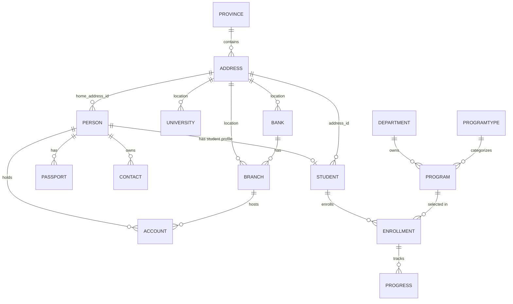

# App Data Schema (DB Layer Only)

## Overview
This schema is derived from the current mock database in `mock/prototypeDatabase.ts`.  
Primary entities are student-centric and grouped into identity, academics, contact, and banking.

For full frontend data contracts (including announcements, permission requests, auth user/session, service contracts, and UI-only fields), see `docs/architecture/frontend-data-model.md`.

## Entity Definitions

### `PERSON`
| Field | Type | Notes |
|---|---|---|
| `id` | number | PK |
| `given_name` | string |  |
| `family_name` | string |  |
| `dob` | string (date) |  |
| `gender` | string | values seen: `M`, `F` |
| `home_address_id` | number | FK -> `ADDRESS.id` |

### `STUDENT`
| Field | Type | Notes |
|---|---|---|
| `id` | number | PK |
| `person_id` | number | FK -> `PERSON.id` |
| `inscription_no` | string | unique-like identifier |
| `address_id` | number | FK -> `ADDRESS.id` (current host address) |

### `PASSPORT`
| Field | Type | Notes |
|---|---|---|
| `id` | number | PK |
| `passport_no` | string |  |
| `issue_date` | string (date) |  |
| `expiry` | string (date) |  |
| `person_id` | number | FK -> `PERSON.id` |

### `CONTACT`
| Field | Type | Notes |
|---|---|---|
| `id` | number | PK |
| `owner_id` | number | FK (logical) -> `PERSON.id` |
| `type` | string | values seen: `EMAIL`, `PHONE`, `EMERGENCY` |
| `value` | string |  |
| `label` | string | examples: `primary`, `mobile`, `name`, `phone` |
| `is_primary` | boolean |  |
| `created_at` | string (datetime) | ISO timestamp |

### `ADDRESS`
| Field | Type | Notes |
|---|---|---|
| `id` | number | PK |
| `name` | string | free-form address text |
| `wilaya_id` | number | FK -> `PROVINCE.id` |

### `PROVINCE`
| Field | Type | Notes |
|---|---|---|
| `id` | number | PK |
| `name` | string | province/city name |

### `UNIVERSITY`
| Field | Type | Notes |
|---|---|---|
| `id` | number | PK |
| `name` | string |  |
| `acronym` | string |  |
| `address_id` | number | FK -> `ADDRESS.id` |

### `DEPARTMENT`
| Field | Type | Notes |
|---|---|---|
| `id` | number | PK |
| `name` | string |  |
| `description` | string |  |

### `PROGRAMTYPE`
| Field | Type | Notes |
|---|---|---|
| `id` | number | PK |
| `name` | string | e.g. `Bachelors`, `Masters`, `PhD` |
| `default_duration` | number | years |

### `PROGRAM`
| Field | Type | Notes |
|---|---|---|
| `id` | number | PK |
| `name` | string | major/program title |
| `description` | string |  |
| `department_id` | number | FK -> `DEPARTMENT.id` |
| `programtype_id` | number | FK -> `PROGRAMTYPE.id` |

### `ENROLLMENT`
| Field | Type | Notes |
|---|---|---|
| `id` | number | PK |
| `registration_no` | string | unique-like identifier |
| `date_enrolled` | string (date) |  |
| `status` | string | values seen: `ACTIVE`, `PENDING`, `COMPLETED` |
| `student_id` | number | FK -> `STUDENT.id` |
| `program_id` | number | FK -> `PROGRAM.id` |

### `PROGRESS`
| Field | Type | Notes |
|---|---|---|
| `id` | number | PK |
| `date` | string (date) |  |
| `semester` | string |  |
| `level` | string | e.g. `L1`, `M1` |
| `grade` | string | stored as string |
| `status` | string | values seen: `COMPLETED`, `PENDING` |
| `enrollment_id` | number | FK -> `ENROLLMENT.id` |

### `BANK`
| Field | Type | Notes |
|---|---|---|
| `id` | number | PK |
| `name` | string |  |
| `code` | number | bank code |
| `address_id` | number | FK -> `ADDRESS.id` |

### `BRANCH`
| Field | Type | Notes |
|---|---|---|
| `id` | number | PK |
| `code` | number | branch code |
| `name` | string |  |
| `address_id` | number | FK -> `ADDRESS.id` |
| `bank_id` | number | FK -> `BANK.id` |

### `ACCOUNT`
| Field | Type | Notes |
|---|---|---|
| `id` | number | PK |
| `account_no` | string |  |
| `rib` | number | account/RIB number |
| `currency` | string | account currency code |
| `date_created` | string (date) |  |
| `branch_id` | number | FK -> `BRANCH.id` |
| `person_id` | number | FK -> `PERSON.id` |

## Relationship Map

## Notes
- The schema is stored as in-memory arrays, so FK constraints are enforced in application logic rather than database-level constraints.
- `CONTACT.owner_id` behaves as a polymorphic owner field in name, but current usage links it to `PERSON.id`.
- `STUDENT` references two addresses: `PERSON.home_address_id` (home) and `STUDENT.address_id` (current/host).

