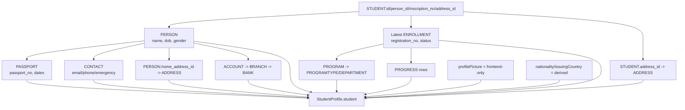
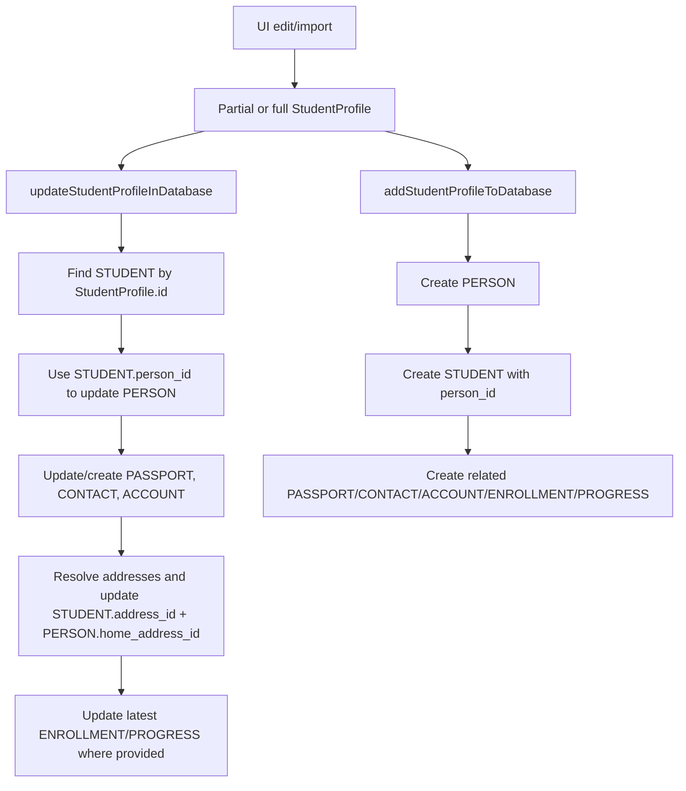

# Data Model Integration Diagrams

This document visualizes how the normalized DB schema (`app-schema.md`) and frontend model (`frontend-data-model.md`) fit together.

## 1) Layered Architecture

```mermaid
flowchart LR
  subgraph DB[Normalized DB Layer]
    PERSON[(PERSON)]
    STUDENT[(STUDENT)]
    PASSPORT[(PASSPORT)]
    ENROLLMENT[(ENROLLMENT)]
    PROGRAM[(PROGRAM + PROGRAMTYPE + DEPARTMENT)]
    CONTACT[(CONTACT)]
    ADDRESS[(ADDRESS + PROVINCE)]
    ACCOUNT[(ACCOUNT + BRANCH + BANK)]
    PROGRESS[(PROGRESS)]
  end

  subgraph MAP[Mapping Layer]
    M1[list/find student mapping\n(lib/students/store.ts)]
    M2[updateStudentProfile\n(lib/students/store.ts)]
    M3[import/ensure student creation\n(lib/students/store.ts)]
  end

  subgraph FE[Frontend Domain Layer]
    SP[StudentProfile]
    UI[Student + Attache UI]
    SVC[studentsService contract]
  end

  DB --> M1 --> SP
  UI --> SVC --> M2 --> DB
  UI --> SVC --> M3 --> DB
  SP --> UI
```

## 2) Read Path (DB -> StudentProfile)



## 3) Write Path (StudentProfile patch -> DB)



## 4) Key Identity and Join Rules

```mermaid
flowchart LR
  SID[StudentProfile.id\n"student-{STUDENT.id}"] --> STUDID[STUDENT.id]
  STUDID --> PID[STUDENT.person_id]
  PID --> PERSONID[PERSON.id]
  PERSONID --> CONTACTS[CONTACT.owner_id]
  PERSONID --> PASSID[PASSPORT.person_id]
  PERSONID --> ACCTID[ACCOUNT.person_id]
  STUDID --> ENRID[ENROLLMENT.student_id]
  ENRID --> PROGRID[PROGRESS.enrollment_id]
```

## 5) Practical Interpretation

- `app-schema.md` is the source of truth for storage structure and keys.
- `frontend-data-model.md` is the source of truth for UI/service contracts.
- Mapper functions in `lib/students/store.ts` are the runtime integration contract between both layers.
- Field differences (for example `profilePicture`, combined address strings, derived nationality) are expected denormalization decisions at the frontend layer.
